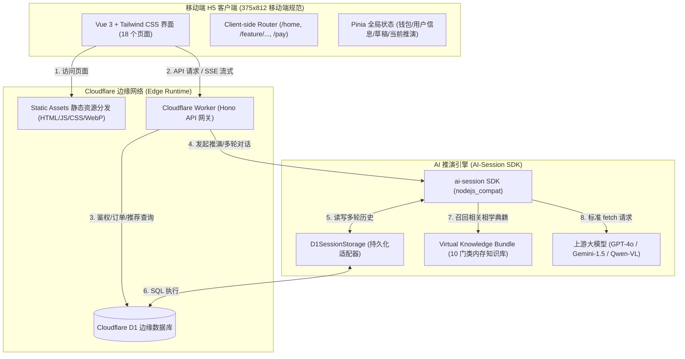

# Architecture: 天机 AI预测大师 (Tianji AI Divination Worker)

## 1. 总体架构与系统拓扑

「天机 AI预测大师」采用 **Cloudflare Workers Fullstack Architecture**（边缘计算全栈架构）。静态前端单页应用（SPA）与后端边缘 API 网关共同部署于同一 Worker 服务下（通过 Cloudflare Workers 的 Static Assets 特性），实现零冷启动、全球就近接入与极低延迟。



---

## 2. 边缘运行时与 SDK 集成架构

根据 `/ssd0/git/AI-Session-NodeJS/docs/cloudflare-workers.md` 规范，系统按以下机制在 Cloudflare Workers 中运行：

### 2.1 Node.js 兼容性配置
SDK 内部使用 `node:crypto` 计算缓存签名及部分流式处理，在 `wrangler.jsonc` 中必须启用：
```jsonc
{
  "name": "palm-face-reading-worker",
  "main": "src/worker/index.ts",
  "compatibility_date": "2025-02-24",
  "compatibility_flags": ["nodejs_compat"],
  "assets": {
    "directory": "./dist-client",
    "binding": "ASSETS"
  },
  "d1_databases": [
    {
      "binding": "DB",
      "database_name": "tianji_divination_db",
      "database_id": "local-dev-id"
    }
  ]
}
```

### 2.2 D1 持久化存储适配器 (`D1SessionStorage`)
实现 SDK 规范的 `IStorage` 接口（`saveSession`, `loadSession`, `updateSession`, `deleteSession`, `listSessions`），使会话跨请求、跨边缘节点无缝连续。

### 2.3 无盘虚拟知识库（Virtual RAG Bundle）
由于 Cloudflare Worker 无法在运行时直接通过 `fs.readFileSync` 读取宿主机物理文件：
1. **构建期打包**：在 Worker 构建时，编译脚本自动将 `knowledge/` 下的 10 大门类 Markdown 知识库打包整合为 JSON 对象（`knowledge-bundle.json`）。
2. **运行时注入**：调用 `ai.session` 时传入：
   ```ts
   system: {
     prompt: categoryPrompt,
     files: knowledgeBundle[categoryKey],
     mode: "rag",
     maxKnowledgeTokens: 2500,
   }
   ```
   SDK 会在内存中自动进行 Markdown 层级解析、大纲提取与关键词精准 RAG 召回，兼顾古籍深度与 Token 经济性。

### 2.4 SSE 实时推演流（Server-Sent Events）
测算推演阶段使用 `session.chatStream`。通过标准 `ReadableStream` 转换为 SSE 数据流输出给前端：
- 事件流类型：`progress`（推演阶段状态切换）、`token`（打字机文本增量）、`done`（推演完成并持久化）。

---

## 3. 领域数据模型与 D1 数据库设计

系统在 Cloudflare D1 中定义 5 张核心业务表：

```sql
-- 1. AI 会话持久化表 (SDK 标准)
CREATE TABLE IF NOT EXISTS ai_sessions (
  user_id TEXT NOT NULL,
  session_id TEXT NOT NULL,
  data TEXT NOT NULL,
  updated_at INTEGER NOT NULL,
  PRIMARY KEY (user_id, session_id)
);
CREATE INDEX IF NOT EXISTS idx_ai_sessions_user ON ai_sessions(user_id, updated_at DESC);

-- 2. 用户与账户表
CREATE TABLE IF NOT EXISTS users (
  id TEXT PRIMARY KEY,               -- 钱包地址 (0x...) 或 游客匿名ID (guest_...)
  nickname TEXT NOT NULL,             -- 默认 "天机缘主"
  wallet_address TEXT,                -- Web3 钱包地址
  free_quota INTEGER NOT NULL DEFAULT 2, -- 剩余免费测算次数
  is_vip INTEGER NOT NULL DEFAULT 0,  -- 0=普通, 1=VIP
  vip_expire_at INTEGER,              -- VIP 到期时间戳
  referral_code TEXT UNIQUE,          -- 用户专属推荐码 (如 TJ8K2M9)
  referrer_id TEXT,                   -- 上级邀请人 ID
  earnings_balance REAL NOT NULL DEFAULT 0.0, -- 可提现 USDT 余额
  total_earned REAL NOT NULL DEFAULT 0.0,     -- 累计获得分润
  total_withdrawn REAL NOT NULL DEFAULT 0.0,  -- 累计已提现
  created_at INTEGER NOT NULL,
  updated_at INTEGER NOT NULL
);

-- 3. 测算订单表
CREATE TABLE IF NOT EXISTS divination_orders (
  id TEXT PRIMARY KEY,               -- 订单编号 TJ202609250001
  user_id TEXT NOT NULL,             -- 下单用户
  category TEXT NOT NULL,            -- 10大门类 (palm_face, bazi, love_match, etc.)
  subcategory TEXT,                  -- 子类型 (如 palm / face / combined)
  input_data TEXT NOT NULL,          -- 用户输入的表单 JSON
  price_usdt REAL NOT NULL,          -- 标价 (如 6.0)
  pay_type TEXT NOT NULL,            -- FREE_QUOTA / USDT_TRC20 / USDT_ERC20
  status TEXT NOT NULL,              -- PENDING / CONFIRMING / COMPLETED / REFUNDED
  tx_hash TEXT,                      -- 链上交易哈希 (若是 USDT 支付)
  referrer_direct_id TEXT,           -- 直推人
  referrer_direct_cut REAL,          -- 直推分润 (15%)
  referrer_indirect_id TEXT,         -- 间推人
  referrer_indirect_cut REAL,        -- 间推分润 (5%)
  created_at INTEGER NOT NULL,
  paid_at INTEGER
);

-- 4. 测算报告表 (支持免费预览与解锁完整版)
CREATE TABLE IF NOT EXISTS divination_reports (
  id TEXT PRIMARY KEY,               -- 报告编号 NO.TJ202609250001
  order_id TEXT NOT NULL,            -- 关联订单
  user_id TEXT NOT NULL,
  category TEXT NOT NULL,
  preview_summary TEXT NOT NULL,     -- 免费综合结论与评分指标 (JSON)
  full_report TEXT,                  -- 完整分章解读与命盘拓扑 (JSON)
  is_unlocked INTEGER NOT NULL DEFAULT 0, -- 是否已解锁完整版
  created_at INTEGER NOT NULL
);

-- 5. 提现申请表
CREATE TABLE IF NOT EXISTS withdrawals (
  id TEXT PRIMARY KEY,
  user_id TEXT NOT NULL,
  amount REAL NOT NULL,              -- 提现金额 (>=10 USDT)
  fee REAL NOT NULL DEFAULT 1.0,     -- 手续费 1 USDT
  actual_amount REAL NOT NULL,       -- 到账金额
  payout_address TEXT NOT NULL,      -- 收款地址
  status TEXT NOT NULL,              -- PENDING / APPROVED / REJECTED
  tx_hash TEXT,
  created_at INTEGER NOT NULL,
  reviewed_at INTEGER
);
```

---

## 4. 十大算命门类 Prompt 与推演引擎设计

| 门类标识 `category` | 对应功能名 | 知识库专著与规范 | 输入要素 | 产出重点 |
| --- | --- | --- | --- | --- |
| `palm_face` | AI 看相 | 《麻衣神相》《许负相法》《面手合参精要》 | 面部照片 / 手掌照片 / 性别 / 生日 | 质检、微观几何度量、六大合参格局、百岁流年、改运寄语 |
| `love_match` | 我们合不合 | 《三命通会》《渊海子平》六合相刑 | 双方姓名、性别、八字时辰、关系 | 纳音合刑、十神配对、相处雷区、合盘契合指数 |
| `phone_plate` | 测手机车牌 | 八星数字能量学、河图洛书数理 | 手机号 / 车牌号、机主生辰八字 | 伏位/绝命/天医八星排布、平安系数、五行补抑 |
| `name_test` | 测姓名店名 | 《康熙字典》三才五格剖象法 | 名称、类型、主人八字、性别 | 天格人格地格五行相生、数理吉凶、音律喜忌 |
| `auspicious_date` | 择日吉日 | 《钦天监崇正辟谬》《协纪辨方书》 | 事项类别、日期区间、主事人八字、城市 | 黄道吉日、建除十二神、廿八宿、冲煞生克首选与备选 |
| `future_fortune` | 未来运程 | 子平流年大运、滴天髓气运流转 | 八字时辰、性别、推演年限 (1/3/5年) | 五年势能曲线、四季明细、关键拐点年份 |
| `bazi` | 八字推测 | 《渊海子平》《滴天髓》《穷通宝鉴》 | 出生年月日时（公/农历）、城市、性别 | 四柱干支排盘、五行强弱、喜用神、十神格局 |
| `qimen_decision` | 成败预测 | 《奇门遁甲兵机》《烟波钓叟赋》 | 所问具体事项、类别、时空点、八字 | 九星八门时空局、天时地利胜算概率、趋吉避凶决策 |
| `personal_naming` | 个人起名 | 八字用神定调、《诗经》《楚辞》 | 姓氏、性别、八字时辰、字数、意象 | 五行喜用神补救、天命吉名方案梯队（字音形义出处） |
| `company_naming` | 公司取名 | 法人命格五行相生、商道纳财风水 | 法人八字、行业赛道、企业类型、风格 | 招财吉名、五行相生契合度、品牌卦象与商道锦囊 |

---

## 5. 前端架构与 Stitch UI 还原方案

### 5.1 技术选型：Vue 3 + Vite + Tailwind CSS + Pinia

经过对成熟前端方案的对比评估：
- **与设计稿高度契合**：`docs/design/stitch_ui` 中的原型代码是标准的 Tailwind CSS class 与语义化 HTML。Vue 3 的单文件组件（SFC）可以直接继承这些现成设计，无需大规模重写 JSX 或样式转换；
- **轻量高效**：Vite 打包输出体积轻巧，无冗余运行时，打包后的静态文件（`dist-client`）直接交由 Cloudflare Worker 的 `assets` 极速分发；
- **状态管理**：Pinia 提供扁平化、清晰的响应式 store（`useUserStore`, `useDivinationStore`, `useUIStore`）；
- **动画库**：轻量级 CSS3 动画驱动星盘、罗盘顺逆时针旋转与粒子飘动效果。

### 5.2 全局导航组件架构
前端全局导航严格遵守两套模式：
1. **模块模式**：
   - 顶部 56px 导航栏（☰抽屉图标、Logo+「天机」、页面标题、未读消息铃铛、金色「＋」快捷操作按钮）；
   - 下方 44px 横向滑动二级副菜单；
   - 点击 ☰ 展开宽 72% 的左侧抽屉（含账户卡、功能列表、底部设置）；
   - 点击「＋」从底部滑出快捷功能 Action Sheet。
2. **流程模式**：
   - 顶部 56px 导航栏（← 返回箭头、Logo+「天机」、当前步骤标题、右侧「＋」或分享操作）；
   - 隐藏二级副菜单与底部导航。

### 5.3 响应式容器规范
在移动端（<640px）以 `375px~430px` 全屏运行；在桌面端采用优雅的居中视口容器（`max-w-[430px] mx-auto min-h-screen shadow-2xl`），外围辅以深夜深蓝黑星空背景，既保障手机 H5 沉浸感，又兼顾 PC 端高质感展示。
