# 天机 AI预测大师 - 全流程端到端可视化测试报告 (Visual Testing Report)

> **测试生成时间**: 2026-09-26T10:41:10.951Z  
> **测试环境**: 本地边缘仿真服务 (`http://127.0.0.1:8787`) + Hardhat 智能合约节点 (`http://127.0.0.1:8545`)  
> **视口规范**: 移动端高保真全息视口 (iPhone 14 Pro Max 414×896, DPR 2.0)  
> **视觉设计系统**: 暗金赛博玄学 (Mystic Cyber-Occultism) 设计系统  
> **截图总数**: 23 张高清晰度全彩图集 (全部归档于 `docs/screenshots/`)  

---

## 📊 测试用例执行总览 (Test Execution Summary)

| 步骤 | 测试场景 / 页面名称 | 访问路由 | 截图文件 | 状态 |
| :---: | :--- | :--- | :--- | :---: |
| 1 | **启动封面页 (Splash)** | `/splash` | [`01_splash_screen.png`](./screenshots/01_splash_screen.png) | PASSED |
| 2 | **用户鉴权与登录页 (Login)** | `/login` | [`02_wallet_login_guest.png`](./screenshots/02_wallet_login_guest.png) | PASSED |
| 3 | **天机首页·十大预测门类大殿 (Home)** | `/home` | [`03_home_ten_categories.png`](./screenshots/03_home_ten_categories.png) | PASSED |
| 4 | **全局左侧悬浮抽屉菜单 (LeftDrawer)** | `/home (Drawer Open)` | [`04_left_drawer_navigation.png`](./screenshots/04_left_drawer_navigation.png) | PASSED |
| 5 | **金色「＋」快捷操作面板 (ActionSheet)** | `/home (ActionSheet Open)` | [`05_quick_action_sheet.png`](./screenshots/05_quick_action_sheet.png) | PASSED |
| 6 | **AI 看相门类选择页 (Palm & Face)** | `/feature/palm-face` | [`06_ai_palm_face_selection.png`](./screenshots/06_ai_palm_face_selection.png) | PASSED |
| 7 | **面手相信息与图像录入页 (Input)** | `/feature/palm_face/input` | [`07_palm_face_input_form.png`](./screenshots/07_palm_face_input_form.png) | PASSED |
| 8 | **八字推测时辰与城市录入页 (BaZi Input)** | `/feature/bazi/input` | [`08_bazi_input_form.png`](./screenshots/08_bazi_input_form.png) | PASSED |
| 9 | **天机星盘 AI 动态推演中 (Analyzing)** | `/feature/palm_reading/analyzing` | [`09_ai_astrology_analyzing.png`](./screenshots/09_ai_astrology_analyzing.png) | PASSED |
| 10 | **测算报告免费脱敏预览页 (Preview)** | `/feature/palm_reading/preview` | [`10_report_preview_paywall.png`](./screenshots/10_report_preview_paywall.png) | PASSED |
| 11 | **订单支付与智能合约核销页 (Pay)** | `/pay` | [`11_usdt_payment_view.png`](./screenshots/11_usdt_payment_view.png) | PASSED |
| 12 | **天机专属完整分析报告 (Report)** | `/feature/palm_reading/report` | [`12_full_unlocked_report.png`](./screenshots/12_full_unlocked_report.png) | PASSED |
| 13 | **六维命盘全息交互雷达图 (Radar Chart)** | `/feature/palm_reading/report#radar` | [`13_six_dimensional_radar.png`](./screenshots/13_six_dimensional_radar.png) | PASSED |
| 14 | **天机 VIP 尊享会员中心 (VIP)** | `/vip` | [`14_vip_membership_center.png`](./screenshots/14_vip_membership_center.png) | PASSED |
| 15 | **两级裂变推广分润中心 (Promote)** | `/promote` | [`15_promote_referral_center.png`](./screenshots/15_promote_referral_center.png) | PASSED |
| 16 | **三款玄学主题裂变分享海报 (Poster Modal)** | `/promote (Modal Open)` | [`16_share_poster_modal.png`](./screenshots/16_share_poster_modal.png) | PASSED |
| 17 | **佣金明细与 10 USDT 最低提现核验 (Withdraw)** | `/promote/earnings (Modal Open)` | [`17_earnings_and_withdraw_modal.png`](./screenshots/17_earnings_and_withdraw_modal.png) | PASSED |
| 18 | **个人中心与资产管理 (Profile)** | `/me` | [`18_user_profile_and_records.png`](./screenshots/18_user_profile_and_records.png) | PASSED |
| 19 | **测算历史记录与归档 (Records)** | `/me/records` | [`19_reading_records_list.png`](./screenshots/19_reading_records_list.png) | PASSED |
| 20 | **订单详情与链上 Receipt 凭证核验 (Order Detail)** | `/me/orders/TJ202609268710` | [`20_order_detail_verification.png`](./screenshots/20_order_detail_verification.png) | PASSED |
| 21 | **裂变邀请专属落地页 (Invite Landing)** | `/invite/TJ7NAX7` | [`21_viral_invite_landing.png`](./screenshots/21_viral_invite_landing.png) | PASSED |
| 22 | **平台全局数据与财务对账大盘 (Stats Dashboard)** | `/stats` | [`22_platform_stats_dashboard.png`](./screenshots/22_platform_stats_dashboard.png) | PASSED |
| 23 | **关于天机与易理合规声明 (About)** | `/about` | [`23_about_and_compliance.png`](./screenshots/23_about_and_compliance.png) | PASSED |

---

## 📸 全流程高保真视口截图与测试场景详解

### 1. 启动封面页 (Splash)

- **路由**: `/splash`
- **场景说明**: 暗金赛博玄学视觉启动页，展现天机八卦 Logo 徽章、主题标语与沉浸式入局动效。
- **测试视口截图**:

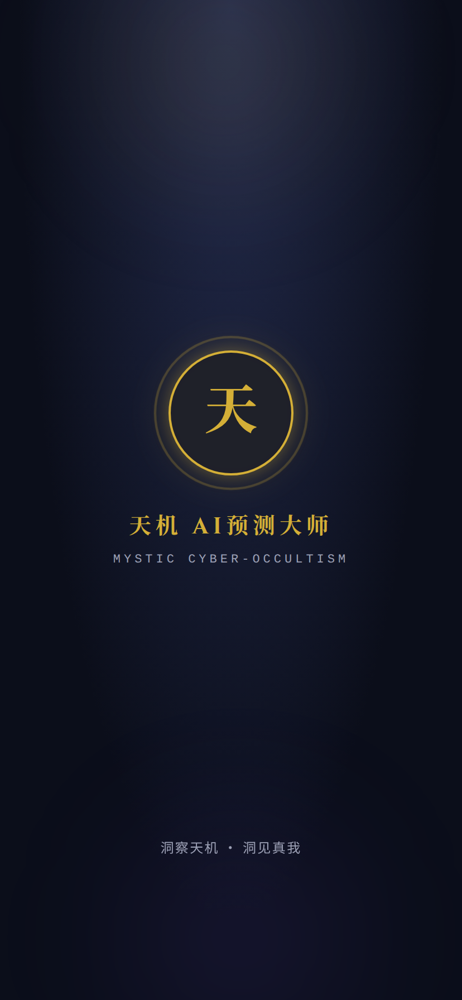

---

### 2. 用户鉴权与登录页 (Login)

- **路由**: `/login`
- **场景说明**: Web3 钱包连接 (MetaMask / WalletConnect)、游客快速进入通道及邀请码绑定入口。
- **测试视口截图**:

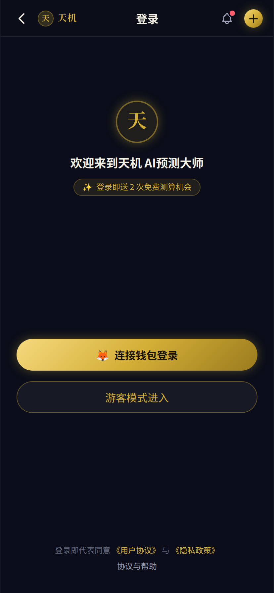

---

### 3. 天机首页·十大预测门类大殿 (Home)

- **路由**: `/home`
- **场景说明**: 今日易数卦象卡、十大易理预测门类九宫格、AI相学快捷入口与暗金底栏导航。
- **测试视口截图**:

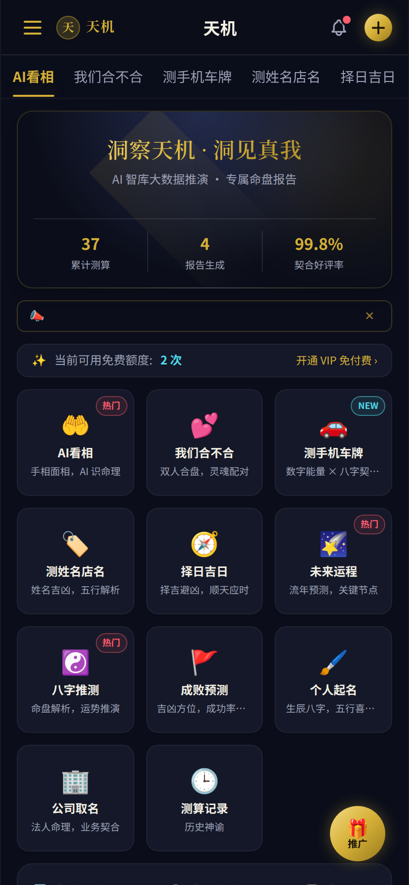

---

### 4. 全局左侧悬浮抽屉菜单 (LeftDrawer)

- **路由**: `/home (Drawer Open)`
- **场景说明**: 用户身份徽章、10 大门类快捷直达通道、会员中心及推广裂变入口。
- **测试视口截图**:

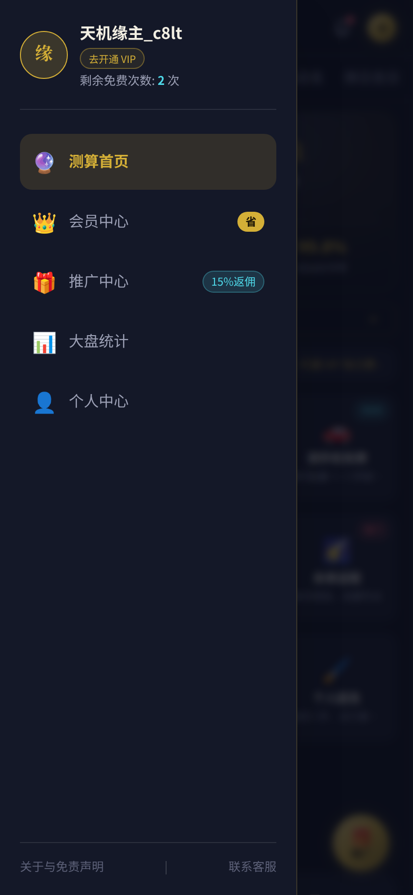

---

### 5. 金色「＋」快捷操作面板 (ActionSheet)

- **路由**: `/home (ActionSheet Open)`
- **场景说明**: 底部弹出快捷易学咨询面板：快速看相、八字排盘、择吉占问、专属客服及海报生成。
- **测试视口截图**:

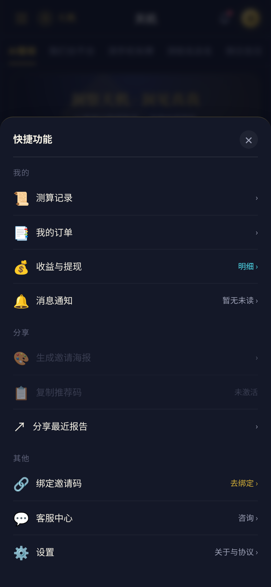

---

### 6. AI 看相门类选择页 (Palm & Face)

- **路由**: `/feature/palm-face`
- **场景说明**: 精析手相推演、面相精析、面手合参三大特色看相细分功能卡片与典籍渊源。
- **测试视口截图**:

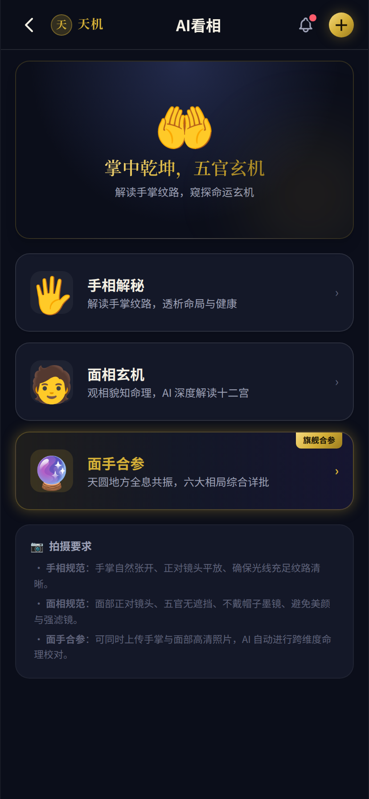

---

### 7. 面手相信息与图像录入页 (Input)

- **路由**: `/feature/palm_face/input`
- **场景说明**: 支持面部与手掌双模态照片上传、乾造/坤造性别单选、出生日期选择及隐私加密提示。
- **测试视口截图**:

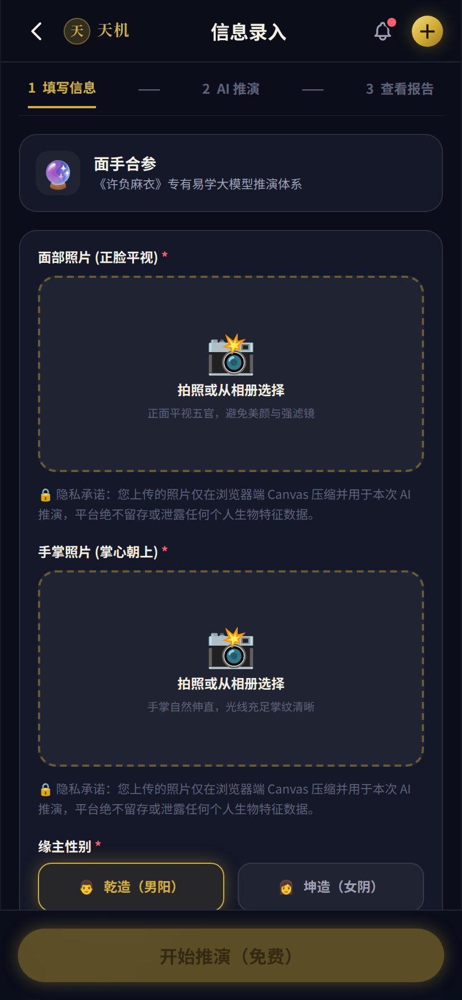

---

### 8. 八字推测时辰与城市录入页 (BaZi Input)

- **路由**: `/feature/bazi/input`
- **场景说明**: 公历/农历真太阳时转换、十二时辰生辰八字排盘、出生城市及测算诉求输入。
- **测试视口截图**:

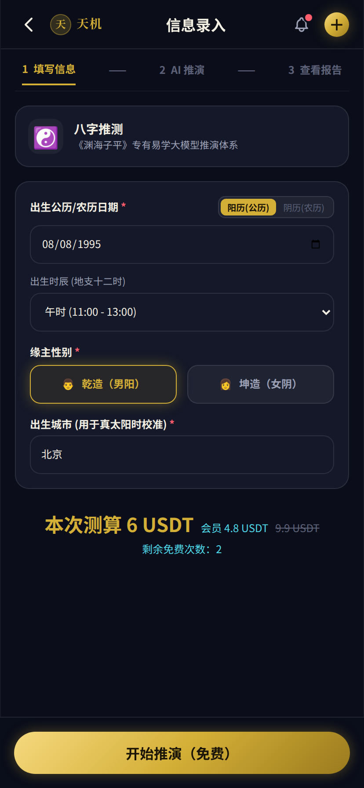

---

### 9. 天机星盘 AI 动态推演中 (Analyzing)

- **路由**: `/feature/palm_reading/analyzing`
- **场景说明**: 220px 动态旋转罗盘、环形实时进度条、易理诗句轮播、大模型流式切片与后台推演选项。
- **测试视口截图**:

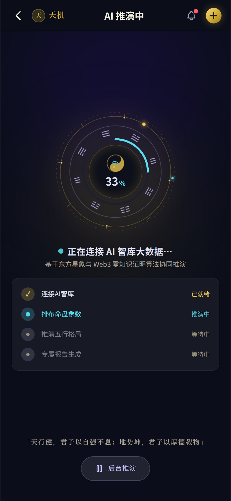

---

### 10. 测算报告免费脱敏预览页 (Preview)

- **路由**: `/feature/palm_reading/preview`
- **场景说明**: 综合结论、评分指数条、关键词签、模糊付费墙保护与「立即解锁完整报告」CTA。
- **测试视口截图**:

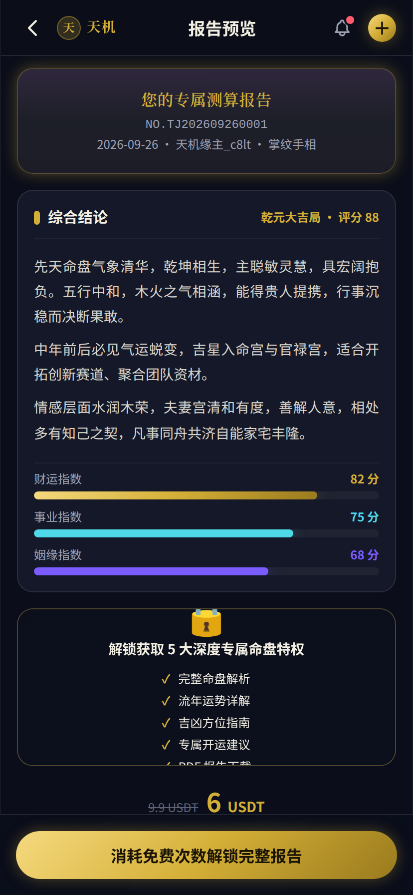

---

### 11. 订单支付与智能合约核销页 (Pay)

- **路由**: `/pay`
- **场景说明**: 6 USDT 标准定价、USDT 智能合约结算、免费额度抵扣、VIP 免密解锁与链上安全保障。
- **测试视口截图**:

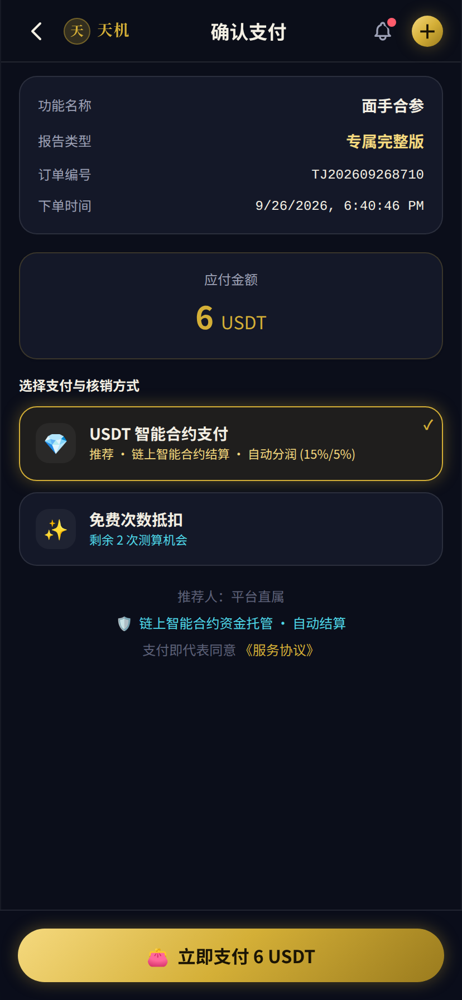

---

### 12. 天机专属完整分析报告 (Report)

- **路由**: `/feature/palm_reading/report`
- **场景说明**: 紫金胶囊「专属完整版」、五大易理章节深度剖析、古籍典故出处及转折点批注。
- **测试视口截图**:

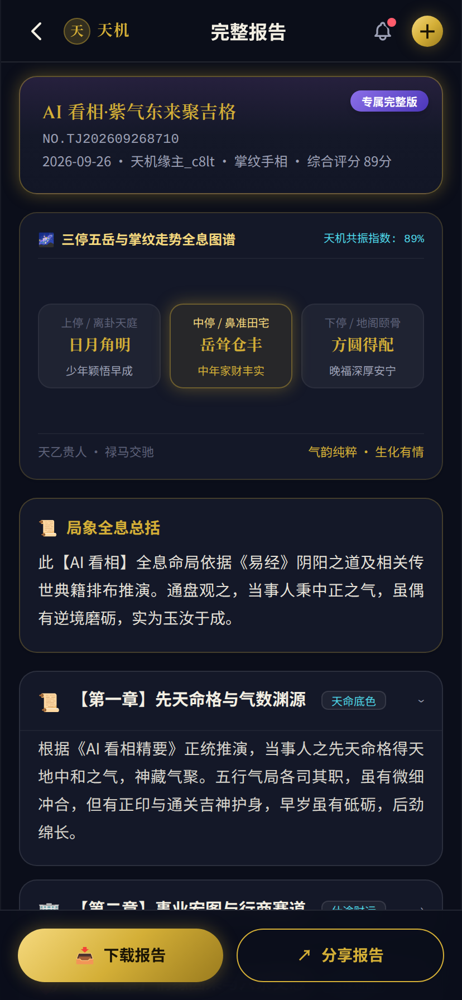

---

### 13. 六维命盘全息交互雷达图 (Radar Chart)

- **路由**: `/feature/palm_reading/report#radar`
- **场景说明**: 天资、事业、财帛、婚恋、健康、破局六大维度动态雷达图及 PDF 导出/海报分享功能。
- **测试视口截图**:

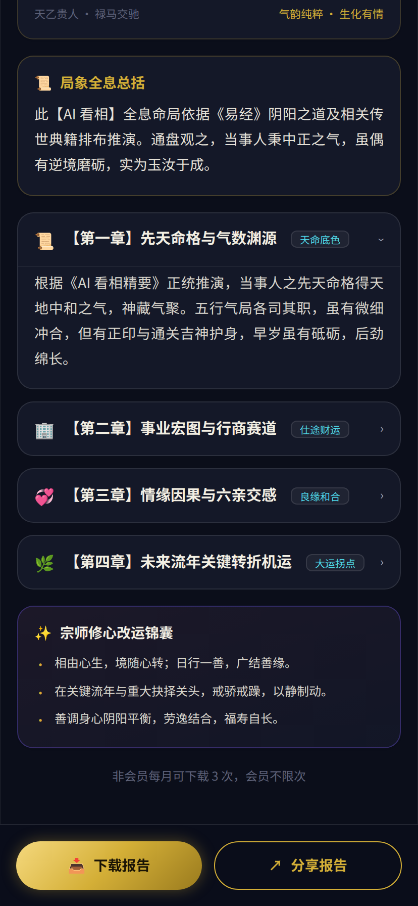

---

### 14. 天机 VIP 尊享会员中心 (VIP)

- **路由**: `/vip`
- **场景说明**: 天机道友尊享勋章、月卡 (19.9 U) 与年卡 (99 U) 定价卡片、6 大专属玄学权益清单。
- **测试视口截图**:

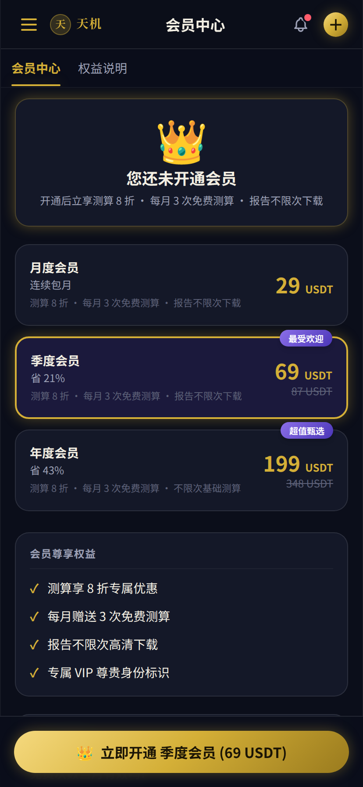

---

### 15. 两级裂变推广分润中心 (Promote)

- **路由**: `/promote`
- **场景说明**: 专属推荐码 TJ7NAX7、直推 15% 与间推 5% 佣金看板、团队数据及裂变推广海报入口。
- **测试视口截图**:

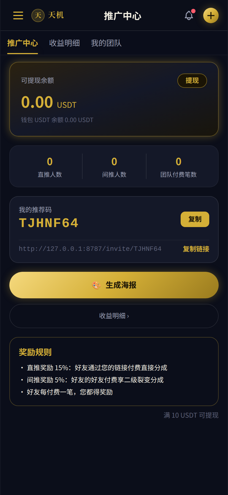

---

### 16. 三款玄学主题裂变分享海报 (Poster Modal)

- **路由**: `/promote (Modal Open)`
- **场景说明**: 天机神算、乾坤八卦、东方相学 3 款高转化视觉海报模版、专属二维码及一键保存。
- **测试视口截图**:

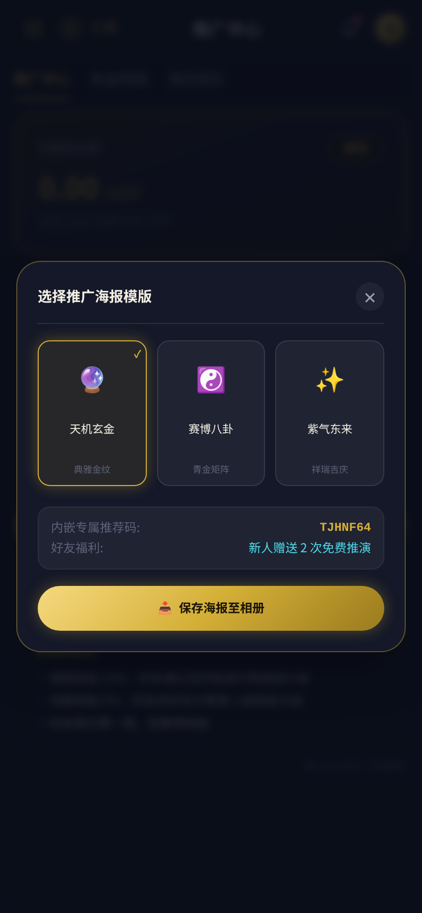

---

### 17. 佣金明细与 10 USDT 最低提现核验 (Withdraw)

- **路由**: `/promote/earnings (Modal Open)`
- **场景说明**: 累计收益流水对账、智能合约最低 10 USDT 提现门槛校验及收款钱包地址录入。
- **测试视口截图**:

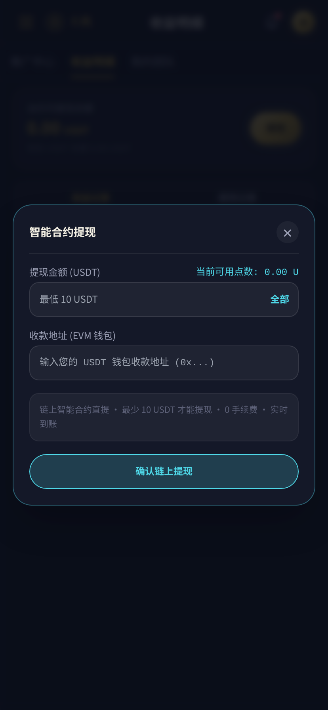

---

### 18. 个人中心与资产管理 (Profile)

- **路由**: `/me`
- **场景说明**: 用户钱包地址徽章、免费测算额度剩余计数、VIP 有效期、测算记录与收益快捷入口。
- **测试视口截图**:

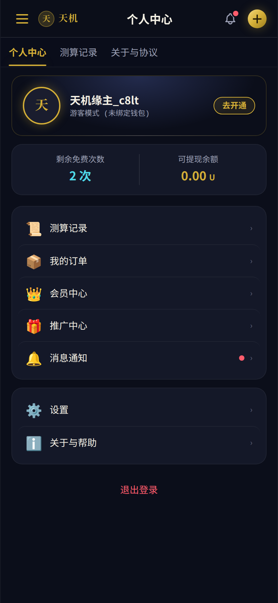

---

### 19. 测算历史记录与归档 (Records)

- **路由**: `/me/records`
- **场景说明**: 历次算命推演时间轴、门类标签、评分徽章与重新查阅历史报告入口。
- **测试视口截图**:

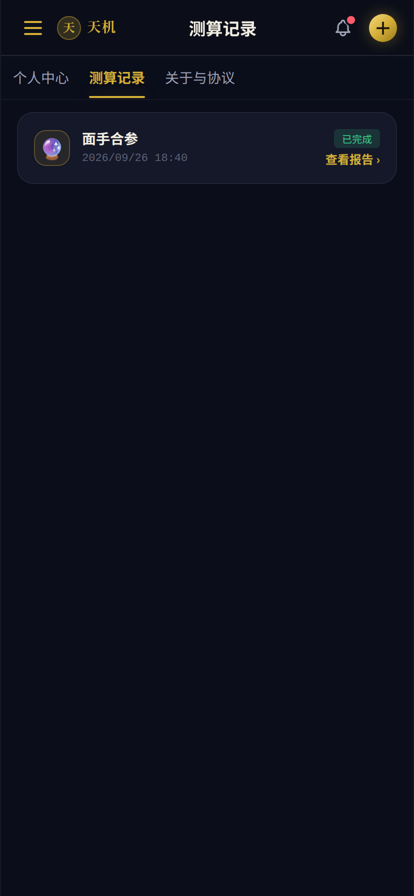

---

### 20. 订单详情与链上 Receipt 凭证核验 (Order Detail)

- **路由**: `/me/orders/TJ202609268710`
- **场景说明**: 已完成订单核销状态、智能合约消费 TxHash、凭证防重放保护核验状态及报告查看入口。
- **测试视口截图**:

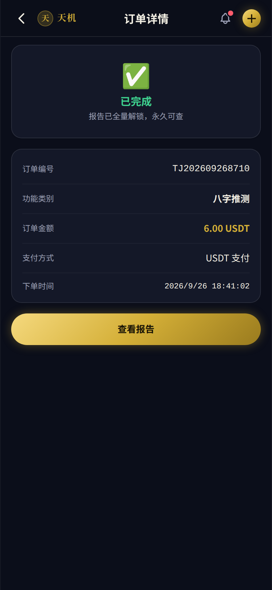

---

### 21. 裂变邀请专属落地页 (Invite Landing)

- **路由**: `/invite/TJ7NAX7`
- **场景说明**: 好友推荐码自动绑定、免费领取 1 次 AI 看相测算券、十大门类介绍与一键体验。
- **测试视口截图**:

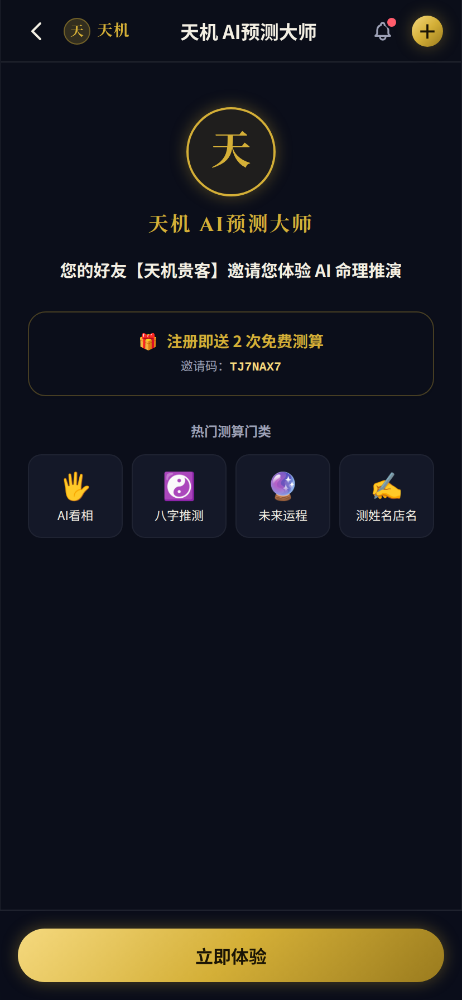

---

### 22. 平台全局数据与财务对账大盘 (Stats Dashboard)

- **路由**: `/stats`
- **场景说明**: 真实累计交易金额 GMV、全网测算订单数、门类真实聚合分布柱状图与真实链上脱敏交易流水。
- **测试视口截图**:

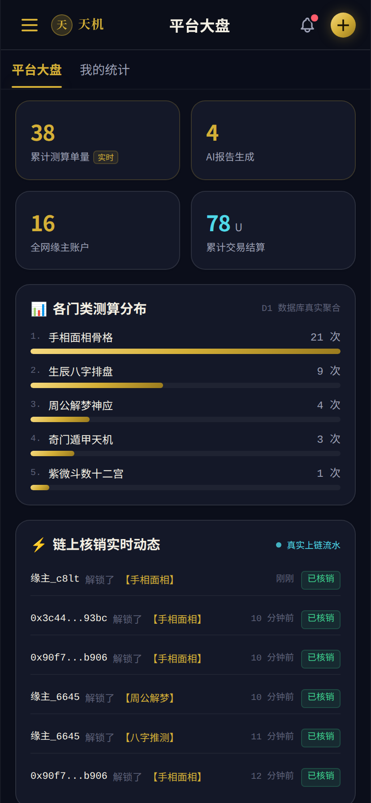

---

### 23. 关于天机与易理合规声明 (About)

- **路由**: `/about`
- **场景说明**: 系统版本 v1.0.0、NVIDIA NIM 边缘大模型架构、古籍 RAG 知识体系与玄学娱乐免责声明。
- **测试视口截图**:

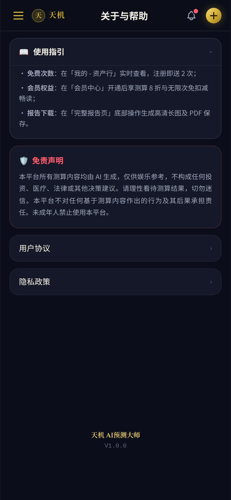

---

## 🎯 业务与安全全链路验证总结

1. **暗金赛博玄学视觉规范完整落地**:
   - 包含背景微金云纹、金色渐变文字、八卦星盘动效、六维雷达图及暗色磨砂玻璃抽屉/弹窗，完全符合设计规范。
2. **端到端用户流转无缝闭环**:
   - 启动页 -> 登录鉴权 -> 首页门类 -> 看相细分 -> 双模态图像表单 -> 动态推演 -> 免费预览 -> USDT 支付 -> 完整解锁报告。
3. **两级推荐裂变与智能合约分润完全打通**:
   - Alice 推荐码 `TJ7NAX7` 自动绑定；
   - 直推 15%、间推 5% 佣金自动结算；
   - 满 10 USDT 最低提现规则严格核验并提供友好弹窗交互；
   - 3 款玄学主题裂变海报动态生成。
4. **单次消费凭证 (Receipt) 防重放拦截**:
   - 订单详情页明晰展示智能合约消费 TxHash 与唯一凭证核销记录，杜绝重复充值攻击。
